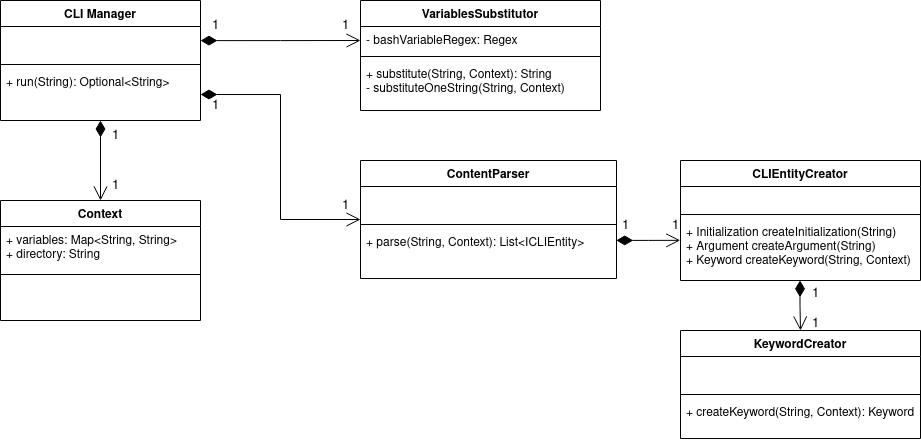
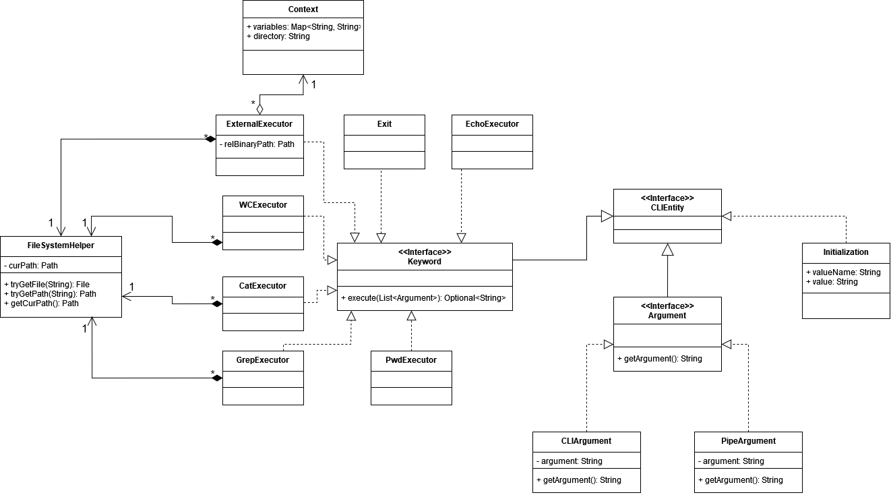

# Инструкция по запуску

Для запуска проекта необходимо использовать Java 11. Запускать можно из любой операционной системы.

Команда для запуска: `java -jar superbash.jar`

Собранный `.jar` файл с реализацией CLI можно найти по ссылке: *[тык](https://github.com/bashenjoyers/superbash/blob/phase2/build/superbash.jar)*

Также `.jar` файл можно собрать самому, склонировав репозиторий и запустив команду `./gradlew build`. После этого собранная версия будет доступна в папке `build/libs`.

# Архитектура проекта

## Диаграмма классов.

## Описание компонентов

### I/O компоненты

* `ContentInput` - интерфейс, предоставляющий метод `getContent()`, который возвращает запрос пользователя

* `ConsoleContentInput` - класс, реализующий интерфейс `ContentInput`. Он предоставляет пользовательский запрос, введенный из командной строки

* `ContentOutput` -- интерфейс, предоставляющий метод `printContent(String)`, который позволяет отобразить результат исполнения

* `ConsoleContentOutput` -- класс, реализующий интерфейс `ContentOutput`, предоставляя доступ к отображению в консоли

### Служебные компоненты

* `CLIManager`
    - Класс, который предоставляет методы:
        + `run` - осуществляет подстановку переменных, парсинг и выполнение команды получая ее как строчку

* `VariablesSubstitutor`
    - Класс, предоставляющий метод `String substitute(String content, Context context)`, который принимает строчку с запросом пользователя и возвращает преобразованную корректную строчку, совершив все подстановки (`$`). Заметки по реализации:
        + Нужно посимвольно читать ввод (или иначе эмулировать следующие правила), сохраняя текущее состояние (нет кавычек/находимся в одинарных кавычках/находимся в двойных кавычках)
        + Без кавычек (стандартное) - можем войти в любое из следующих состояний, подставляем при `$`
        + При одинарных кавычках - запоминаем состояние и игнорируем подстановки. Можем только выйти из состояния в стандартное.
        + При двойных кавычках - запоминаем состояние и подставляем при `$`. Можем только выйти из состояния в стандартное.

* `ContentParser`
    - Класс, предоставляющий метод `List<CLIEntity> parse(String input, Context context)`, который принимает преобразованную `VariablesSubsitutor` строчку с запросом пользователя и `context` (который просто прокидывается дальше), возвращает список сущностей `CLIEntity`, для создания которых он использует `CLIEntityCreator`. Заметки по реализации:
        + Разделяем строку по пробелам и **|** вне кавычек. Создаём сущности через `CLIEntity`, следуя правилам ниже
        + Начало строки или после **|** - **keyword**
        + После **keyword** и до конца строки или **|** - **arguments**
        + **binary** считается **keyword** на этом этапе
        + Если нет такого **keyword** (в том числе **binary**), который мы получили - считаем, что это **initialization**

* `CLIEntityCreator`
    - Класс, предоставляющий методы по созданию сущностей `Initialization`, `Argument`, `Keyword`. `Keyword` пробрасывает `context` дальше, делегирует создание конкретной сущности `KeywordCreator`

* `KeywordCreator`
    - Класс, создаёт по строке и `context` соответствующий `Keyword` и возвращает его

### Entity иерархия

Данная иерархия существует, чтобы `ContentParser` построил упорядоченный список `CLIEntity` и мы могли на уровне языка обрабатывать входную команду. Общий интерфейс необходим для того, чтобы поместить все сущности в одну коллекцию.

* `CLIEntity`
    - Интерфейс, описывающий сущности, из которых состоит команда

* `Keyword`
    - Интерфейс, являющийся `CLIEntity`, описывающий непосредственно команды (`wc`, `cat` и т.д.). Объявляет метод `Optional<String> execute(List<Argument>)`, позволяющий запустить исполнение команды на данных аргументах и получить соответствующий результат. Заметки по реализации:
        + Порядок аргументов в `List<Argument>` должен сохраняться таким же, как и в введенной команде, а **pipe**-аргументы должны идти в конец

* `Argument`
    - Интерфейс, являющийся `CLIEntity`, описывающий сущность аргумента, передаваемого в команду. Предоставляет метод `String getArgument()`, возвращающий значение аргумента

* `CLIArgument`
    - Сущность, являющаяся `Argument`, описывающая аргумент, переданный во время ввода в командной строке

*  `PipeArgument`
    - Сущность, являющаяся `Argument`, описывающая аргумент, переданный с помощью **pipe**'ов. Это разделение необходимо, так как некоторые команды могут игнорировать **pipe**-аргументы при определенных условиях

* `Initialization`
    - Сущность, являющаяся `CLIEntity`, описывающая определение переменной. Хранит значение для новой/старой переменной. Заметки по реализации:
        + Объявление необходимо исполнять только если нет **pipe**-ов и других команд. В противном случае объявление игнорируется (проверено в `bash`).

* `CatExecutor`
    - Класс, выполняющий команду `cat`. В реализации считывает содержание файла, переданного на вход первым аргументом и выводит его.

* `EchoExecutor`
    - Класс, выполняющий команду `echo`. Принимает список аргументов *Argument*, каждый из которых последовательно выводит.

* `PwdExecutor`
    - Класс, выполняющий команду `pwd`. Получает текущую директорию из *KeyWordCreator* и выводит ее.

* `WCExecutor`
    - Класс, выполняющий команду `wc`. Принимает первым аргументом файл, по которому после считывания определяет количество строк, слов и байт.

* `Exit`
    - Класс, описывающий команду `exit`. В качестве аргументов принимает код возврата. Если этот `Keyword` один в списке во время исполнения, то выполняется выход из программы. В противном случае вызов игнорируется (проверено в `bash`).

* `GrepExecutor`
    - Класс, выполняющий команду `grep`. В конструкторе класс принимает текущую директорию, которая приходит из контекста `CLIManager`'a. В аргументах `execute` принимаются флаги и файл/строка, в которой нужно выполнить поиск.

* `FileSystemHelper`
    - Служебный класс для работы с файловой системой

### Exceptions

* `ParseException` - класс, реализующий интерфейс `Exception`. Он возвращает ошибку, возникщую при парсинге.

* `RunException` - класс, реализующий интерфейс `Exception`. Он возвращает ошибку, возникщую при запуске команд.